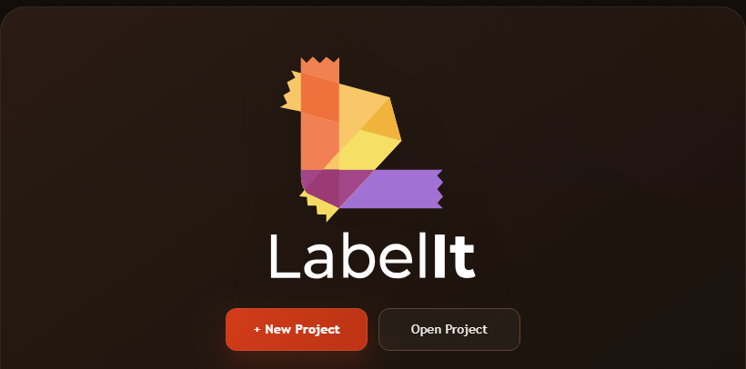
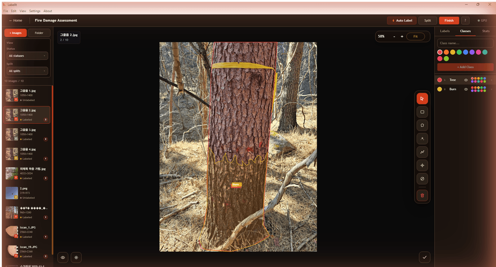
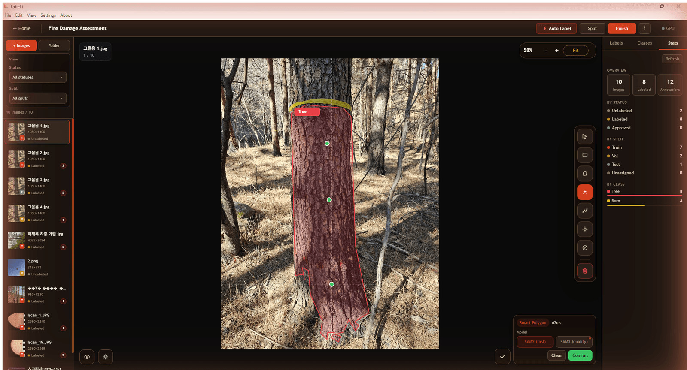
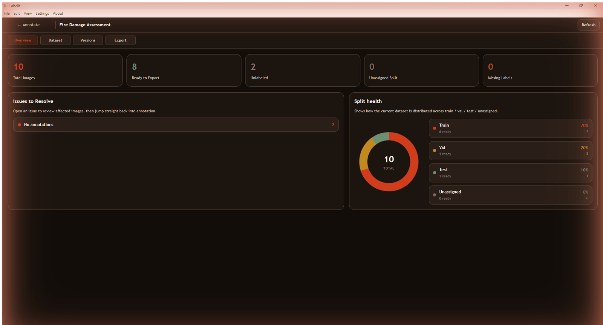
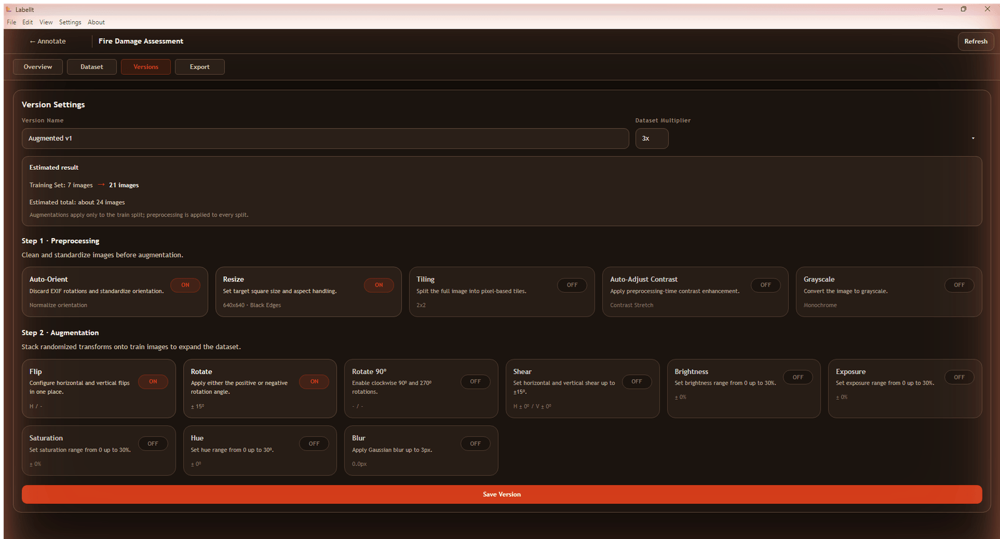
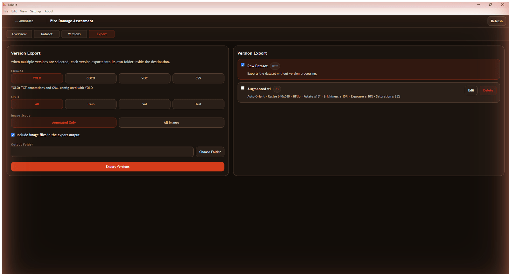
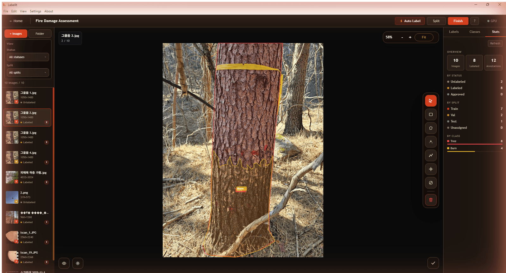

<div align="center">



### Fully local desktop image annotation software for computer vision datasets

[](https://github.com/th00tames1/LabelIt/releases/latest)
[](https://github.com/th00tames1/LabelIt/releases/latest)
[](https://www.electronjs.org/)
[](https://react.dev/)

</div>

---

## Overview

LabelIt is a desktop application for building object detection and segmentation
datasets. It runs entirely on your machine. Images are never uploaded, no account
is required, and no network connection is needed for any annotation feature.

The application covers the full dataset lifecycle in one place: importing existing
labeled data, drawing and refining annotations, reviewing quality, splitting into
train, validation and test sets, generating augmented dataset versions, and
exporting to standard training formats.

Each project is stored as a single SQLite file (`project.lbl`) alongside your
images. Source images are referenced by path and are never modified.

---

## Annotation workspace

Draw bounding boxes, polygons, polylines and keypoints. Overlapping objects can be
cycled through by repeated clicking, and a selected shape keeps its handles on top
so corners stay easy to grab. A dashed crosshair follows the cursor to make precise
placement straightforward.



The left panel lists every image with its status, split assignment and annotation
count. The right panel manages label classes and shows live dataset statistics.

---

## Smart Polygon

Smart Polygon runs Segment Anything locally to convert a few clicks into an
accurate polygon. Left click adds a positive point, right click adds a negative
point, and the mask updates after each click. Both SAM 2.1 and SAM 3 are
selectable, and inference runs on a CUDA GPU when one is available.



In the capture above, three positive points produced a complete tree mask in 67 ms
on an NVIDIA RTX 3060.

---

## Dataset review and split health

The Finish workspace reports which images are ready for export and which still
have unresolved issues, such as missing annotations or unassigned splits. Split
health shows the current train, validation and test distribution at a glance.



---

## Dataset versions and augmentation

Create reproducible dataset versions on top of the same source annotations. A
version records its preprocessing steps and its augmentation recipe, so the same
configuration can be exported again at any time. Augmentations are applied to the
training split only, while preprocessing applies to every split.



Preprocessing includes auto orientation, resizing, tiling, contrast adjustment and
grayscale conversion. Augmentation includes flips, rotation, shear, brightness,
exposure, saturation, hue and blur.

---

## Export

Export the raw dataset or any saved version to YOLO, COCO, Pascal VOC or CSV.
Formats that cannot represent the annotation types present in your project are
disabled rather than silently dropping data. Each export is written to its own
folder, and a folder is never overwritten.



| Format | Bounding box | Polygon | Polyline | Keypoint |
| --- | :---: | :---: | :---: | :---: |
| YOLO | Yes | Yes | No | No |
| COCO | Yes | Yes | No | No |
| Pascal VOC | Yes | Yes | No | No |
| CSV | Yes | Yes | Yes | Yes |

---

## Statistics

Class balance, status breakdown and split distribution are always visible while
annotating, so problems are caught before export rather than after training starts.



---

## Feature summary

**Annotation**
- Bounding box, polygon, polyline and keypoint tools
- Smart Polygon segmentation powered by SAM 2.1 and SAM 3
- YOLO automatic labeling with a review queue
- Vertex level editing, including insertion and deletion
- Multi select in the image list with batch status and split changes

**Dataset management**
- Import existing labels from YOLO, COCO, Pascal VOC and CSV with automatic format detection
- Train, validation and test splits with configurable auto split
- Image status workflow covering unlabeled, labeled, reviewed and excluded
- Excluded images stay in the project with their labels but are omitted from split, export and augmentation

**Output**
- Export to YOLO, COCO, Pascal VOC and CSV
- Reproducible dataset versions with augmentation recipes
- Collision safe export folders

**Platform**
- Runs fully offline, with no telemetry and no account
- CUDA GPU acceleration with automatic CPU fallback
- Dark and light themes
- English and Korean interface

---

## Installation

Download the installer for your platform from the
[latest release](https://github.com/th00tames1/LabelIt/releases/latest).

| Platform | File | Notes |
| --- | --- | --- |
| Windows 10/11 (x64) | `LabelIt-<version>-Setup.exe` | Standard installer |
| macOS (Apple Silicon) | `LabelIt-<version>-mac-arm64.dmg` | M1 and newer |
| macOS (Intel) | `LabelIt-<version>-mac-x64.dmg` | Intel based Macs |
| Linux (x64) | `LabelIt-<version>-linux-x86_64.AppImage` | Portable, no installation |
| Linux (x64) | `LabelIt-<version>-linux-amd64.deb` | Debian and Ubuntu |

### Windows

Run the installer and follow the prompts. Windows SmartScreen may warn that the
publisher is unrecognized because the build is not signed with a commercial
certificate. Choose **More info** and then **Run anyway**.

### macOS

The macOS builds are not signed with an Apple Developer certificate, so Gatekeeper
blocks them on first launch. After moving the app to Applications, right click it
and choose **Open**, then confirm. Alternatively, allow it under
**System Settings > Privacy & Security**.

### Linux

For the AppImage, mark it executable and run it:

```bash
chmod +x LabelIt-*.AppImage
./LabelIt-*.AppImage
```

For the Debian package:

```bash
sudo dpkg -i LabelIt-*-linux-amd64.deb
sudo apt-get install -f
```

---

## Optional AI setup

Manual annotation, import and export work immediately after installation. Smart
Polygon and YOLO automatic labeling additionally require Python, which powers a
local inference service that the application starts and stops automatically.

**Requirements**
- Python 3.10, 3.11 or 3.12 (3.13 is not yet supported by all dependencies)
- Roughly 5 GB of free disk space for PyTorch and the model weights
- An NVIDIA GPU with CUDA is optional and significantly faster than CPU

Open **AI Setup** inside the application and follow the guided installation. The
wizard creates an isolated virtual environment and downloads the model weights. No
data leaves your machine at any point, during setup or during inference.

Model weights are downloaded once and cached locally. The first Smart Polygon
request on a new image spends a moment computing the image embedding, and every
subsequent click reuses it.

---

## Getting started

1. Choose **New Project** and select a folder. If the folder already contains
   images and label files, both are imported automatically.
2. Create label classes in the **Classes** panel on the right.
3. Select a tool from the rail on the right edge of the canvas and begin annotating.
4. Press <kbd>Space</kbd> to mark an image complete and jump to the next unlabeled one.
5. Open **Finish** to review dataset readiness, assign splits and export.

To attach labels to images that are already in a project, place the label files
next to the images and import the folder again. Existing annotations are never
overwritten, and only images without annotations receive the imported labels.

---

## Keyboard shortcuts

| Action | Shortcut |
| --- | --- |
| Next / previous image | <kbd>Tab</kbd> / <kbd>Shift</kbd>+<kbd>Tab</kbd>, or arrow keys |
| Next unlabeled image | <kbd>N</kbd> |
| Mark complete and continue | <kbd>Space</kbd> |
| Select tool | <kbd>V</kbd> |
| Bounding box | <kbd>W</kbd> |
| Polygon | <kbd>E</kbd> |
| Smart Polygon | <kbd>S</kbd> |
| Polyline | <kbd>L</kbd> |
| Keypoint | <kbd>K</kbd> |
| Assign class 1 to 9 | <kbd>1</kbd> to <kbd>9</kbd> |
| Undo / redo | <kbd>Ctrl</kbd>+<kbd>Z</kbd> / <kbd>Ctrl</kbd>+<kbd>Y</kbd> |
| Duplicate selection | <kbd>Ctrl</kbd>+<kbd>D</kbd> |
| Delete selection | <kbd>Delete</kbd> |
| Finish polygon | <kbd>Enter</kbd> or double click |
| Cancel current drawing | <kbd>Esc</kbd> |
| Fit image to view | <kbd>F</kbd> or <kbd>0</kbd> |
| Pan vertically / horizontally | Mouse wheel / <kbd>Shift</kbd>+wheel |
| Zoom | <kbd>Ctrl</kbd>+wheel |
| Pan by dragging | Middle drag, right drag, or <kbd>Alt</kbd>+left drag |
| Shortcut reference | <kbd>?</kbd> |

---

## Building from source

**Prerequisites**
- Node.js 20 or newer
- A C++ toolchain for the native dependencies (Visual Studio Build Tools on
  Windows, Xcode Command Line Tools on macOS, `build-essential` on Linux)

```bash
git clone https://github.com/th00tames1/LabelIt.git
cd LabelIt
npm install

# Run in development
npm run dev

# Build an installer for the current platform
npm run build:win     # Windows
npm run build:mac     # macOS
npm run build:linux   # Linux
```

Installers are written to `dist/`.

Native modules such as `better-sqlite3` and `sharp` are compiled per platform and
architecture, so an installer must be produced on the platform it targets. The
repository includes a GitHub Actions workflow that builds all four targets on
matching runners and attaches them to a release. Push a version tag to trigger it:

```bash
git tag v1.5.0
git push origin v1.5.0
```

---

## Architecture

| Layer | Technology |
| --- | --- |
| Application shell | Electron 33, electron-vite |
| Interface | React 19, TypeScript, Zustand |
| Canvas | Konva |
| Storage | SQLite via better-sqlite3 |
| Image processing | sharp |
| Inference service | Python, FastAPI, Ultralytics, PyTorch |

All coordinates are stored normalized to the range 0 to 1, which keeps annotations
correct across resizing and augmentation. Database access is confined to the main
process, and the renderer communicates through a typed IPC bridge with context
isolation enabled.

---

## License

Copyright (c) 2026 Heechan Jeong, Advanced Forestry Systems Lab, Oregon State
University. All rights reserved.

This software is licensed for personal and commercial use. Redistribution,
sublicensing, or resale of this software, in whole or in part, without prior
written permission from the copyright holder is prohibited. See
[resources/LICENSE.txt](resources/LICENSE.txt) for the full text.

---

<div align="center">
Developed at the Advanced Forestry Systems Lab, Oregon State University
</div>
